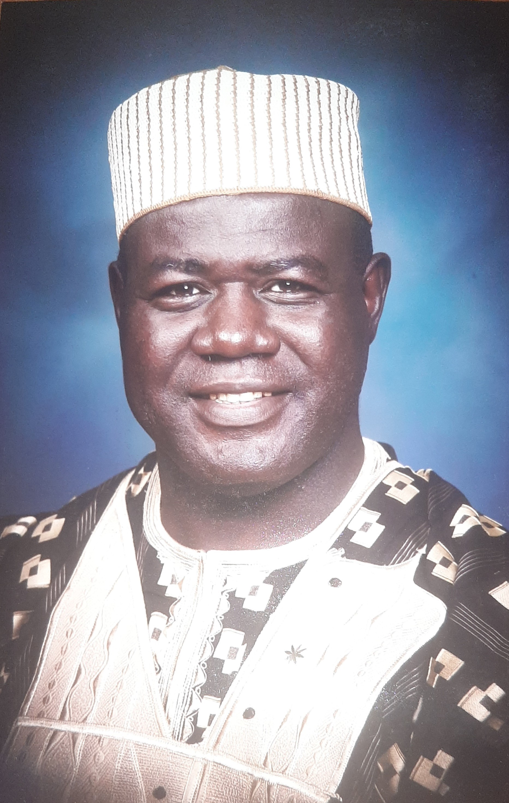
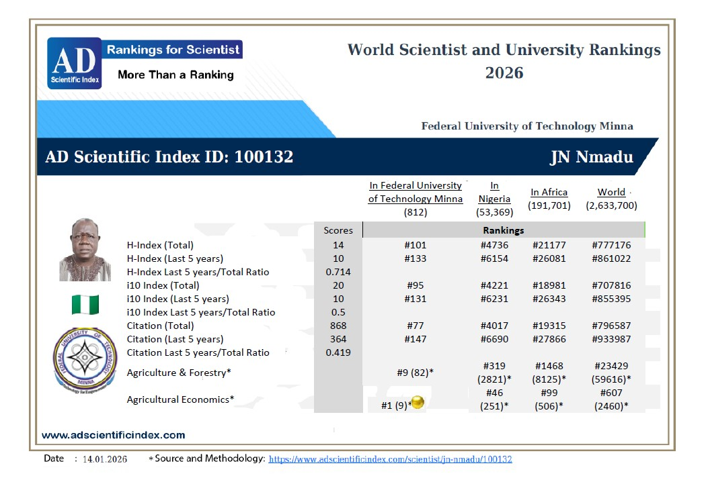

# **Job Nmadu**, **Professor of Econometric Modeling**

*Data-Driven Development through transforming complex agricultural research and interventions into actionable economic and welfare effects, empowering development.*

*Three decades of industry experience in teaching research and community development as Head of Department, Industrial Liaison Officer, Dean, Director, Consultant, Church and Community leader.*

# Role

Professor of Econometric Modeling, Data Science & Machine Learning

# Affiliations

<i class="fa-solid fa-book-open-reader"></i> [Federal University of Technology, Minna, Nigeria](https://www.futminna.edu.ng)

<i class="fa-solid fa-book-open-reader"></i> [Kubu Science and Technology Institute, South Africa](https://www.ksti.co.za/) 

<i class="fa-solid fa-book-open-reader"></i> [Marwadi University, Rajkot, India](https://www.marwadiuniversity.ac.in/) 

# Education

 PhD in Agricultural Economics, [Ahmadu Bello University, Zaria](), 2002

 MSc in Agricultural Economics, [Ahmadu Bello University, Zaria](), 1998
  
 Diploma in Data Processing and Computer Programming, Soft Design Computer Institute, Zaria, 1995
  
 BSc in Agriculture, [Ahmadu Bello University, Zaria](), 1987

# Interests

- Agricultural, Development and Environmental Economics

- Econometric Modeling

- Data Science and Machine Learning

- Computable General Equilibrium

# Skills

 Data Collection, Wrangling, Analysis and Visualisation | 85%
  
<i class="fa-solid fa-user-secret"></i> Leadership, Administration and Coordination | 80%

<i class="fa-solid fa-toolbox"></i> Modelling, Data Science, Machine Learning, R/CGE Programming | 70%

<i class="fa-brands fa-searchengin"></i> Research, Consultancy, Collaboration and Networking | 75%
  
# Experience

- Professor, [The Federal University of Technology](https://www.futminna.edu.ng)
  
  * Teaching, Research and Community Development
  
  * Head of Department
  
  * Director and industrial Liaison Officer
  
  * Dean of Faculty
  
  * Consultancies, Networking and Collaborations

- Chief Lecturer, [The Federal Polytechic](https://fedpolybida.edu.ng)
  
  * Lecturing, Research and Community Development
  
# Accomplishments

- Advanced Leadership Seminar, [Haggai Institute](https://www.haggai-international.org), 2006

- Practical General Equilibrium Modelling with GAMS, [EcoMod School](https://ecomod.net/modeling-school), 2016

- Introduction to data Scieence, [Udemy](https://www.ude.my./UC-0J47DLH0), 2019

- E-Platform on Weather and Climate Services for Resilience development: A Guide for Practitioners and Policy makers [The World Bank Group The Open Learning Campus](https://olc.worldbank.org/), 2019

- Certified VIRT2UE Traine, [The Embassy of Good Science](https://embassy.science/wiki/AboutCertifiedTrainers), 2019

- World Scientist and University Rankings, [AD Scientific Index](https://adscientificindex.com/scientist/jn-nmadu/100132/), 2013-2026

Proudly re-syndicated by [R-bloggers](http://r-bloggers.com/)
